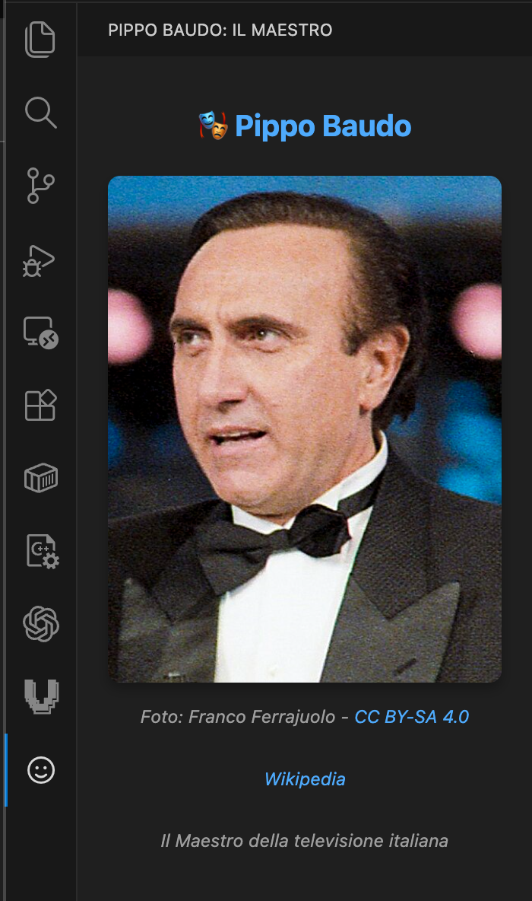

# Pippo Baudo Viewer

Un'estensione VS Code che mostra una foto di Pippo Baudo nella barra laterale.



## Installazione

### Da file .vsix
```bash
code --install-extension dist/pippo-baudo-viewer-1.0.0.vsix
```

### Sviluppo
1. Apri il progetto in VS Code
2. Premi F5 per avviare l'Extension Development Host
3. L'estensione apparirà nella sidebar

## Crediti

- Foto: Franco Ferrajuolo - [CC BY-SA 4.0](https://creativecommons.org/licenses/by-sa/4.0/)
- [Wikipedia](https://it.wikipedia.org/wiki/Pippo_Baudo)

## Licenza

MIT
